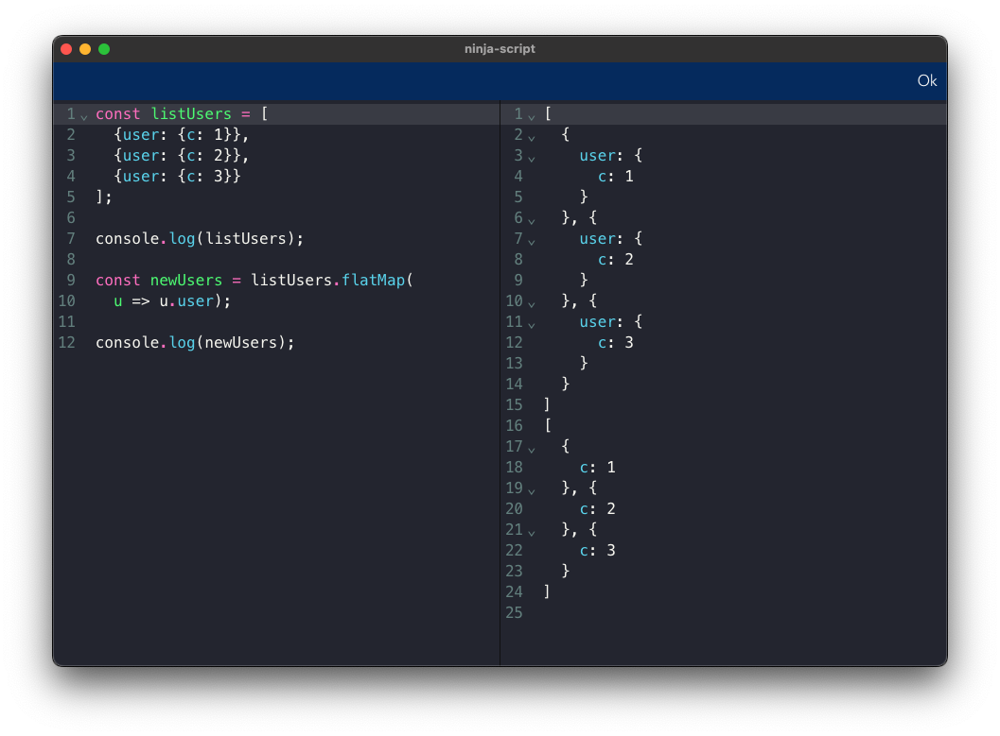

# Ninja Script

A JS/TS playground write using Tauri + React + Vite + Rust, made for fun <3

## Pre-requisites

- [Bun](https://bun.sh/) (currently only `bun runtime` is available on windows)
- [Pnpm](https://pnpm.io/es/installation)
- [Rust](https://www.rust-lang.org/tools/install)
- [Tauri-cli](https://tauri.app/v1/guides/getting-started/setup/vite)

### Bun
Bun is the core of this project, is used to process JS/TS code.

### Pnpm
Pnpm is used for the installations of dependencies and build the React App components.

### Rust
Rust is used for compiling and building the app

## Usage

Install tauri-cli using `cargo`, use `cargo install tauri-cli`

To start the development build, use `cargo tauri dev`

To build the app, use `cargo tauri build`

## License
- MIT

## TODO
- [] Change default icon (right now is used the Tauri icon, hehe)
- [] Use `which` / `where` to determine bun path
- [] Re-structure app to improve clean code
- [] Write unit test, ups!
- [] Create new tabs
- [] Stylising the app to improve UI/UX
- [] Theme selector
- [] Improve my english :P
- ... and more

### Enjoy ;)
